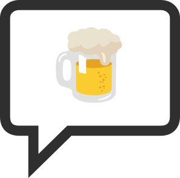

Beerchat
-----------------

Chat mod for minetest

(heavily modified version of the "original" beerchat mod: https://github.com/evrooije/beerchat.git)

# Overview

Standalone chat channel mod

Features
* Chat channels
* Whispering (`$ hello there`)
* Shortcommands (`#channel hello` `@player hello`)
* Matterbridge-integration (IRC/Discord/matrix/etc)

# Compatibility

* Minetest >= 5.0

# Documentation

* [Manual](./doc/manual.md)
* [Matterbridge](./doc/matterbridge.md)

# License

## Code

* LGPLv3

## logo.svg / logo.png

* Created with icons from:
  * https://commons.wikimedia.org/wiki/File:Emoji_u1f4ac.svg `Apache License 2.0`
  * https://commons.wikimedia.org/wiki/File:Emoji_u1f37a.svg `Apache License 2.0`

## Sounds

* `beerchat_chime.ogg` `CC0 1.0` https://freesound.org/people/jgreer/sounds/333629/
* `beerchat_chirp.ogg` `CC-BY 4.0` https://freesound.org/people/zimbot/sounds/178027/
* `beerchat_utter.ogg` `CC0 1.0` https://freesound.org/people/plasterbrain/sounds/243022/
