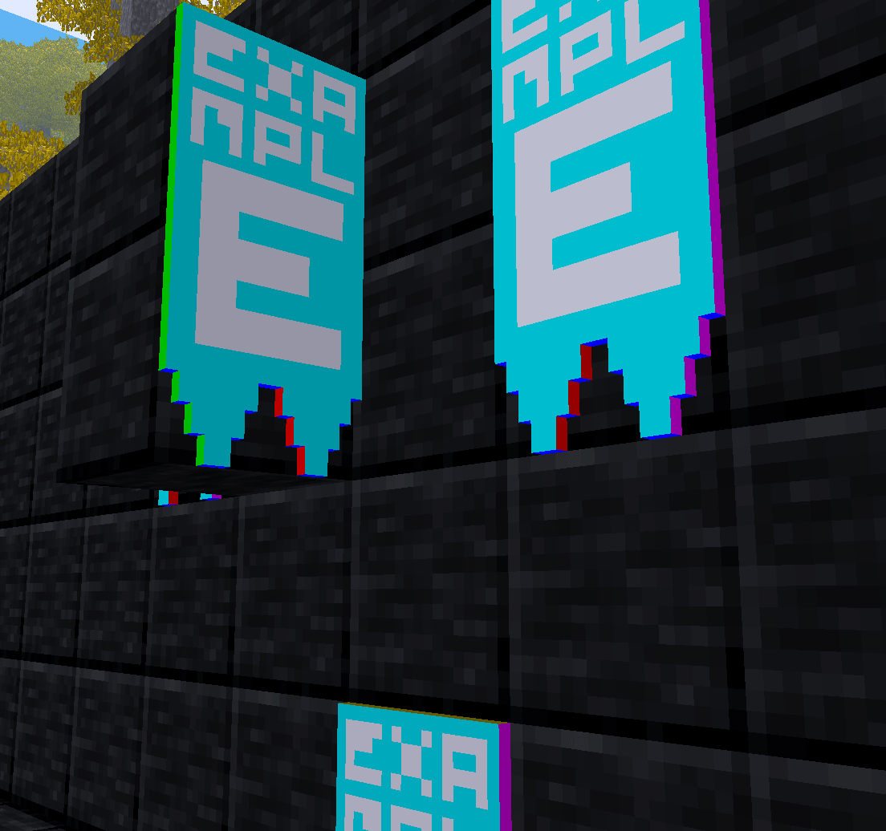

# Clan Tapestries / Клановые гобелены

Создаются самими игроками и добавляются по запросу. Рекомендуется использовать [libresprite](https://libresprite.github.io/) для рисования.

| Формат шаблона | Скачать |
| -------------- | -------------------------------- |
| 16x16 |  |
| 32x32 |  |

*Вид шаблона 16x16 в игре:*

