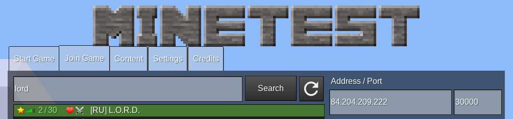

# Официальный репозиторий сервера L.O.R.D.

Можно копать... Можно не копать....

L.O.R.D. - это сервер Minetest с миром в стиле [Властелина колец](https://ru.wikipedia.org/wiki/%D0%92%D0%BB%D0%B0%D1%81%D1%82%D0%B5%D0%BB%D0%B8%D0%BD_%D0%BA%D0%BE%D0%BB%D0%B5%D1%86).

<table>
    <tr><th align="left">Наш сайт:</th><td>https://lord-server.ru/</td></tr>
    <tr><th align="left">Группа VK:</th><td>https://vk.com/minetest_lord</td></tr>
    <tr><th align="left">Discord:</th><td>https://www.discord.gg/uTX3mbb</td></tr>
</table>

#### Что такое Minetest ?

Minetest - это аналог игры Minecraft с открытым исходным кодом.

#### Сервер L.O.R.D.

Чтобы начать увлекательное путешествие по миру:
 - [скачайте](https://www.minetest.net/downloads/) и запустите клиет для игры Minetest.
 - переключитесь на вкладку "Join Game" ("Присоединиться к игре")
 - в строке поиска введите `lord` и нажмите "Search" ("Найти")

 - среди найденнх серверов, наш - с названием "\[RU\] L.O.R.D." (кликните на него)
 - справа появится формочка для заполнения
 - придумайте себе ник, не забудьте задать пароль

## Contributors (Участники)

 - [@Badger](https://github.com/albel4) - infrastructure administration / development / game admin
 - [@weqqr](https://github.com/weqqr) (Sc) - development / game admin / moderation
 - [@Mikola](https://github.com/Mikola314) - moderation / social content / testing / development
 - [@Elrick](https://github.com/googolgl) - development / infrastructure development
 - [@VladTcvs](https://github.com/vladtcvs) (VladTs) - development / testing
 - [@alek13](https://github.com/alek13) (Alek) - development / testing / release management / site dev
 - [@Doloment](https://github.com/Doloment) - development / testing
 - [@narrnika](https://github.com/narrnika) - development / moderation
 - @Sachiel (Сахиель Корчмастер) - moderation
 - @Dimon - moderation / social content

В строительстве [Минас-Тирит](https://vk.com/minetest_lord?z=video-110633545_456239020) принимали участие:
 - @Mikola
 - @Narrnika
 - @Tchibo
 - @Badger
 - @Liza
 - @HALINA
 - @Tanushka

Если мы мы кого-то забыли или вы нехотите, чтобы вас упоминали в этом списке, присылайте pull-request или попросите нас в [Discord](https://www.discord.gg/uTX3mbb).
